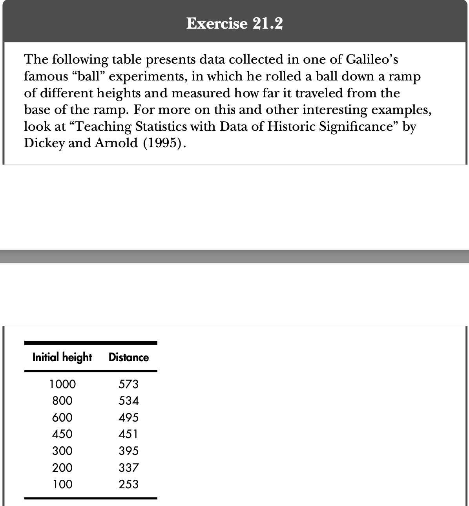

```{r setup, include=FALSE}
knitr::opts_chunk$set(include = TRUE, echo = TRUE)
```

<br>
<br>

# **1. Regresia Liniara Simplă**

<br>

## **1.1. Definirea regresiei liniare simple**


Regresia liniara simpla este o metoda statistica prin care se descrie **relatia dintre doua variabile**:

- Variabila **independenta**, de obicei notata cu X, numita **variabila explicativa** sau **predictor**
- Variabila continua **dependenta** rezultata, notata cu Y, numita **variabila raspuns**.


### **1.1.1 Un exemplu de relație liniară**

Pentru a exemplifica o relatie liniara, se va folosi data frame-ul Student Survey Data, din cadrul pachetul MASS. Componentele utilizate in continuare in cadrul exemplului sunt:

- *Wr.Hnd*, intinderea palmei
- *Height*, inaltimea persoanei in cm


```{r}
library(MASS)
plot(survey$Height~survey$Wr.Hnd,xlab="Intinderea palmei (cm)", ylab="Inaltime (cm)",
     sub = "Graficul relatiei dintre inaltimea si intinderea palmei studentilor analizati in setul de date")
```


Dupa cum poate fi observat din graficul de mai sus, exista o **asociere pozitiva** dintre intinderea palmei si inaltime. Aceasta asociere se poate observa si din calculul coeficientului de corelatie.


```{r}
cor(survey$Wr.Hnd,survey$Height,use="complete.obs")
```


<br>

## **1.2. Concepte generale**


Scopul modelului de regresie liniara este de **a gasi o functie pentru a estima valoarea medie a variabilei rezultat, fiind data valoarea predictorului**. 

In cazul setului de date amintit anterior, se poate considera regresia liniara pentru a determina urmatorul rezultat: ce inaltime ne asteptam sa aiba un student care are intinderea mainii de 15 cm? 

### **1.2.1 Definirea modelului**

Modelul regresiei liniare simple defineste valoarea raspunsului conditionat de valoarea variabilei explicative cu ajutorul urmatoarei formule:

$$
Y|X = \beta_0 + \beta_1X + \epsilon
$$

#### Parametrii modelului

- X - **predictorul** sau variabila explicativa
- Y - **variabila dependenta**
- $\beta_0$ - **interceptorul** - valoarea rezultata cand predictorul e 0
- $\beta_1$ - **panta** - schimbarea pe care o are valoarea medie rezultata odata cu cresterea predictorului
- $\epsilon$ - **reziduul** sau eroarea estimarii


Regresia liniară calculeaza dreapta **cu cea mai bună potrivire** pentru datele de antrenare, gasind coeficientii de regresie care **minimizează eroarea totală $\epsilon$ a modelului**.

Considerand parametrii estimati $\hat{\beta_0}$ si $\hat{\beta_1}$, modelul determina valoarea medie a raspunsului, notata cu $\hat{y}$, pentru valoarea predictor x, dupa formula:

$$
\hat{y} = \hat{\beta_0} + \hat{\beta_1}x
$$


### **1.2.2 Regresia liniara simpla folosind R**

R pune la dispozitie comanda **lm** care realizeaza estimarea parametrilor:

```{r}
survfit <- lm(Height~Wr.Hnd,data=survey)
survfit
```

Astfel, putem observa ca modelul estimat este:

$$
\hat{y} = 113.954 + 3.117x
$$
Conform ecuatiei, putem interpreta ca la fiecare crestere cu 1 cm a intinderii palmei, inaltimea persoanei va creste cu 3,117 cm.

Anterior, am definit reziduul ca fiind eroarea estimarii. Aceasta poate fi vazuta pe grafic ca segmentul trasat intre valoarea estimata de regresia liniara si valoarea reala. Modelul de regresie liniara simpla vrea sa minimizeze aceste erori, ea fiind dreapta ce se va afla cel mai aproape de toate observatiile. 

In continuare vom reprezenta graficul observatiilor din setul de date, impreuna cu dreapta determinata de ecuatia modelului de regresie. De asemenea, vom trasa si segmentul dintre valorile reale si valoarile estimate a doua observatii, pentru a ilustra eroarea estimarii.

```{r}
plot(survey$Height~survey$Wr.Hnd,xlab="Intinderea mainii (cm)", ylab="Inaltime (cm)",
     sub = "Linia regresiei liniare simple, erorile de estimare si graficul datelor din survey ")
abline(survfit,lwd=2)

obsA <- c(survey$Wr.Hnd[197],survey$Height[197])
obsB <- c(survey$Wr.Hnd[154],survey$Height[154])
mycoefs <- coef(survfit)
resid <- mycoefs[1]
fitted <- mycoefs[2]

segments(x0 = c(obsA[1], obsB[1]), y0 = resid + fitted * c(obsA[1], obsB[1]), x1 = c(obsA[1], obsB[1]), y1 = c(obsA[2], obsB[2]), lty=2)
```

<br>

## **1.3. Inferenta statistica**

In cadrul regresiei liniare simple, trebuie sa ne intrebam daca exista o dovada care sa sustina faptul ca o schimbare in variabila explicativa afecteaza raspunsul mediu. In continuare vom vedea mai multe metode de testare a acestei ipoteze.

### **1.3.1 Metoda summary din R**

Inferenta bazata pe model este realizata direct in R cu ajutorul metodei **summary**. Vom aplica metoda pe modelul nostru:

```{r}
summary(survfit)
```

<br>

#### **Reziduul**

Reziduul reprezinta diferenta dintre valoarea actuala si cea estimata. Valorea medianei ne spune daca daca exista o simetrie in reziduurile rezultate. 


#### **Coeficientii**

Prima coloana din sectiunea *coefficients* contine **valorile estimate** pentru interceptor si panta. 


Urmeaza **Std. Error**, **deviatia standard**. Aceasta estimeaza deviatia standard a coeficientilor - cat de multa incertitudine exista in estimarea coeficientilor. Valorile pot fi folosite pentru a afla intervale de incredere.


**Valoarea t** este rezultata prin calcularea raportului dintre coeficient si deviatia standard. In general, vrem ca valoarea t sa fie mare, deoarece indica faptul ca deviatia standard este mica fata de coeficient. Astfel, cu cat este mai mare valoarea t, cu atat putem fi mai siguri ca valoarea coeficientului nu este 0.


**Valoarea p** ne ajuta sa intelegem cat de semnificativ este coeficientul nostru in model. De obicei, valorile sub 0.05 sunt considerate semnificative. In cazul in care acesta este semnificativ, inseamna ca ar adauga valoare in estimarea rezultatului. De asemenea, numarul de stelute din dreptul valorii p ne indica cat de semnificativ este un parametru.


#### **Eroarea reziduala standard - residual standard error**

Aceasta masura ne spune cat de bine a estimat modelul datele. Din rezultat, putem deduce faptul ca valorile reale ale inaltimii sunt, in medie, cu 7.9 cm mai departe fata de valorile rezultate.


#### **Multiple R-squared**

Valoarea lui multiple R-squared descrie ce procent din variatia raspunsului este influentat de predictor. Aceasta este o metoda prin care se determina cat de bine se potriveste modelul cu datele noastre. In cazul regresiei liniare simple, multiple R-squared poate fi calculat si ca valoarea corelatiei la patrat.


In exemplul nostru, 36% din variatia din cadrul inaltimii este determinata de intinderea mainii.


#### **F-statistic si valoarea p**

F-statistic si valoarea lui p ne poate ajuta si pentru a confirma sau infirma ipoteza nula. Ipoteza nula afirma ca nu exista o relatie intre variabila dependenta si cea independenta. Vom defini ipotezele:

$$
H_0: \beta_j = 0 \\
H_A: \beta_j \neq 0
$$


Noi dorim sa stim daca exista un efect dat de predictor, adica panta este diferita de 0. Este cunoscut faptul ca daca valoarea p este cu mult mai mica ca 0, atunci exista o dovada puternica asupra faptului ca ipoteza nula este falsa, astfel putem concluziona faptul ca exista o relatie intre variabila independenta si cea dependenta.


In exemplul nostru, valoarea p este $2 * 10^{-16}$, deci ipoteza nula este infirmata: o crestere a intinderii mainii este asociata cu o crestere in inaltime a populatiei care este studiata. De asemenea, pentru modele mici, o valoare F-statistic mare ne indica faptul ca ipoteza nula poate fi respinsa.

<br>

## **1.4. Predictia valorilor**

Cand dorim sa calculam rezultatul unei predictii, inlocuim in ecuatie valoarea lui x de care suntem interesati, insa rezultatul final va fi supus unei variatii, 

### **1.4.1 Intervale de incredere si intervale de predictie**

**Intervalele de confidenta** sunt folosite pentru a descrie variabilitatea mediei raspunsului, in timp ce **intervalele de predictie** sunt folosite pentru a oferi intervalul posibil de valori pe care o observatie individuala o poate avea, fiind dat x. 

In continuare vom calcula intervalele de incredere si de predictie pentru un handspan de 14.5 cm si de 24 cm cu un nivel de incredere de 95%, folosind functia **predict** din R:


```{r include=TRUE}
xvals <- data.frame(Wr.Hnd=c(14.5,24))
mypred.ci <- predict(survfit,newdata=xvals,interval="confidence",level=0.95)
mypred.ci
mypred.pi <- predict(survfit,newdata=xvals,interval="prediction",level=0.95)
mypred.pi

plot(survey$Height~survey$Wr.Hnd,xlim=c(13,24),ylim=c(140,205),
xlab="Writing handspan (cm)",ylab="Height (cm)")
abline(survfit,lwd=2)

points(xvals[,1],mypred.ci[,1],pch=8)
segments(x0=c(14.5,24),y0=c(mypred.pi[1,2], mypred.pi[2,2]), x1=c(14.5,24), y1=c(mypred.pi[1,3],mypred.pi[2,3]),col="gray",lwd=3)
segments(x0=c(14.5,24),y0=c(mypred.ci[1,2], mypred.ci[2,2]), x1=c(14.5,24), y1=c(mypred.ci[1,3], mypred.ci[2,3]),lwd=2)
xseq <- data.frame(Wr.Hnd=seq(12,25,length=100))
ci.band <- predict(survfit,newdata=xseq,interval="confidence",level=0.95)
pi.band <- predict(survfit,newdata=xseq,interval="prediction",level=0.95)
lines(xseq[,1],ci.band[,2],lty=2)
lines(xseq[,1],ci.band[,3],lty=2)
lines(xseq[,1],pi.band[,2],lty=2,col="gray")
lines(xseq[,1],pi.band[,3],lty=2,col="gray")
legend("topleft",legend=c("Fit","95% CI","95% PI"),lty=c(1,2,2),
col=c("black","black","gray"),lwd=c(2,1,1))
```

### **1.4.2 Interpolarea si Extrapolarea**

Interpolarea si extrapolarea sunt doi termeni ce **descriu natura unei predictii**.

O predictie este referita ca fiind **interpolare** cand valoarea x a predictorului se afla in intervalul datelor observate la antrenare. In momentul in care x este in exteriorul intervalului, are loc o extrapolare.

In exemplul analizat anterior, cazul x = 14.5 cm este o interpolare, iar x = 24 cm este o extrapolare.

In general, este **preferabil sa fie utilizata interpolarea**, deoarece se alege o valoare din intervalul care a fost analizat, sau extrapolarea in cazul in care x este in vecinatatea intervalului.

Un exemplu de extrapolare care ofera rezultate nerealiste este x = 0. Astfel, un om cu intinderea mainii de 0 cm ar avea o inaltime egala cu 114 cm, rezultatele fiind improbabile. Un alt exemplu aberant ar fi pentru o intindere a mainii de 55 cm. Vom calcula rezultatul folosind functia predict.

```{r}
predict(survfit,newdata=data.frame(Wr.Hnd=55),interval="confidence",
level=0.95)
```

Se observa ca valoarea prezisa este de 285 cm, ceea ce nu are sens in contextul problemei analizate.

## **Exercitiul 20.1**

<center>
  
</center>

<center>
  
</center>

**a.**
```{r}
pred_a.ci <- predict(survfit, newdata = data.frame(Wr.Hnd = c(12, 15.3, 17, 19.9)), interval = "confidence", level = 0.99)
pred_a.ci
```

**b.** 

```{r}
# ia observatiile incomplete
incomplete.obs <- which(is.na(survey$Height) | is.na(survey$Wr.Hnd)) 
rho.xy <- cor(survey$Wr.Hnd, survey$Height, use = "complete.obs")
# determina coeficientii cu ajutorul formulelor
b1 <- rho.xy * (sd(survey$Height[-incomplete.obs]) / sd(survey$Wr.Hnd[-incomplete.obs]))
b0 <- mean(survey$Height[-incomplete.obs])-b1*mean(survey$Wr.Hnd[-incomplete.obs])
b0
b1
# afiseaza coeficientii rezultati folosind survfit
survfit
```

**c.**
i.

Ecuatia este: y = 177.857 - 0.072x


```{r}
survfit.pulse <- lm(Height~Pulse, data=survey)
survfit.pulse
plot(survey$Height~survey$Pulse, xlab="Pulsul (bpm)",ylab="Inaltimea (cm)")
abline(survfit.pulse,lwd=2)

```

ii. 

```{r}
summary(survfit.pulse)
confint(survfit.pulse, level = 0.9)
```

Conform rezultatelor, pentru fiecare bataie pe minut in plus, media inaltimii studentului scade cu 0.072. 

Din calcularea intervalelor de incredere, se observa ca intervalul de incredere contine valoarea 0, deci panta ar putea sa fie 0.
De asemenea, valoarea p pentru panta este 0.275, nu suficient de mica incat sa fie considerata semnificativa. Nu exista dovezi care ar putea respinge H0, astfel ca nu poate fi concluzionat faptul ca pulsul afecteaza inaltimea unui student. Aceasta ipoteza este sustinuta si printr-un F-statistic mic de 1.199, dar si prin multiple R-squared cu valoarea mica de 0.007, astfel ca numai 0.7% din inaltime e influentata de puls.

iii. 

```{r}
# definim un interval de interes
x_seq <- data.frame(Pulse=seq(45,120,length=100))
plot(survey$Height~survey$Pulse, xlab="Pulsul (bpm)",ylab="Inaltimea (cm)")

pred_iii.ci <- predict(survfit.pulse, newdata = x_seq, interval = "confidence", level = 0.9)
pred_iii.pi <- predict(survfit.pulse, newdata = x_seq, interval = "prediction", level = 0.9)
lines(x_seq[,1], pred_iii.ci[,2], lty=2)
lines(x_seq[,1], pred_iii.ci[,3], lty=2)
lines(x_seq[,1], pred_iii.pi[,2], lty=2, col="gray")
lines(x_seq[,1], pred_iii.pi[,3], lty=2, col="gray")
legend("topright",legend=c("CI 90%","PI 90%"),lty=2,col=c("black","gray"))
```

iv.

```{r}
# creeaza vectorul incomplete
incomplete.obs <- which(is.na(survey$Height) | is.na(survey$Pulse))
plot(survey$Height~survey$Pulse, xlab="Pulsul (bpm)",ylab="Inaltimea (cm)")
m <- mean(survey$Height[-incomplete.obs])
abline(h = m, col='brown', lty=3, lwd=3)
pred_iii.ci <- predict(survfit.pulse, newdata = x_seq, interval = "confidence", level = 0.9)
pred_iii.pi <- predict(survfit.pulse, newdata = x_seq, interval = "prediction", level = 0.9)
lines(x_seq[,1], pred_iii.ci[,2], lty=2)
lines(x_seq[,1], pred_iii.ci[,3], lty=2)
lines(x_seq[,1], pred_iii.pi[,2], lty=2, col="gray")
lines(x_seq[,1], pred_iii.pi[,3], lty=2, col="gray")
```

Dreapta in interiorul intervalului de incredere, ceea ce sustine faptul ca panta ar avea valoarea 0, deci pulsul nu influenteaza inaltimea unui student.


**d.**

```{r}
?mtcars
plot(mtcars$mpg~mtcars$wt, xlab="Greutate", ylab="MPG")
```

**e.**

```{r}
cars.fit<- lm(mpg~wt,data=mtcars)
cars.fit
plot(mtcars$mpg~mtcars$wt, xlab="Greutate", ylab="MPG")
abline(cars.fit, lwd = 2)
```

**f.**

```{r}
summary(cars.fit)
```

Ecuatia este: y = 37.285 - 5.344x, unde y reprezinta MPG mediu si x este greutatea.

La fiecare crestere a greutatii cu o unitate (1000 lbs), mpg scade cu -5.344.
Valoarea lui p este foarte mica (1.29e-10), deci ipoteza nula este infirmata, ceea ce arata ca exista o dovada statistica puternica ca MPG se schimba odata cu greutatea.


**g.**

```{r}
predict(cars.fit, newdata = data.frame(wt = 6), interval = "prediction", level = 0.95)
```

Modelul nu prezice cu exactitate observatiile, deoarece a fost folosita o extrapolare cu mult in exteriorul intervalului de date observate. Astfel, PI asociat are o limita inferioara negativa, care nu are sens in contextul MPG. 


<br>

## **1.5. Predictori categorici**


In sectiunea anterioara a fost analizat modelul regresiei liniare simple asupra unei variabile explicative continue. In continuare se va analiza cazul in care **variabila explicativa este categorica** - o variabila care poate lua un numar fix de posibile valori, fiecare reprezentand un grup sau o categorie.


### **1.5.1 Variabile binare: k = 2**

Vom trata cazul variabilelor binare, in care predictorul va avea doua categorii cu valorile 0, respectiv 1.

Ecuatia regresiei liniare simple in cazul in care variabila predictor e categorica se pastreaza, aceasta fiind:

$$Y|X=\beta_0 + \beta_1X + \epsilon$$

Insa semnificatiile coeficientilor ecuatiilor se vor schimba, devenind:

- $\beta_0$ va avea semnificatia de **baseline** sau **referinta** pentru cazul in care $X = 0$, intrucat Y devine $Y = \beta_0 + \epsilon$
- $\beta_1$ va fi **efectul aditiv** in cazul in care $X = 1$, deoarece $Y = \beta_0 + \beta_1 + \epsilon$

<br>

#### **Analiza grafica**

Pentru a analiza modelul de regresie liniara simpla asupra variabilelor categorice, se vor folosi variabilele Sex - de tip factor, cu valorile Female si Male - si Height din data frame-ul Survey. 
Vrem sa determinam daca exista o dovada statistica conforma careia inaltimea unui student este influentata de sexul acestuia.

Vom construi un plot ce contine doua boxplot-uri cu cele doua categorii, impreuna cu punctele determinate de datele de intrare si cu inaltimile medii.

```{r}
plot(survey$Height~survey$Sex, xlab = "Sex", ylab="Inaltime (cm)", sub="Graficul relatiei dintre inaltime studentilor si categoria in care se afla: Female sau Male")
points(survey$Height~as.numeric(survey$Sex),cex=0.5)
means.sex <- tapply(survey$Height,INDEX=survey$Sex,FUN=mean,na.rm=TRUE)
points(1:2,means.sex,pch=4,cex=2)
```

In urma plotului, se observa ca barbatii tind sa fie mai inalti decat femeile, dar trebuie gasite dovezi statistice care sa sustina aceasta afirmatie.


###  **Regresie liniara cu predictor categoric folosind R**

Vom folosi functia **lm** pentru a estima coeficientii:

```{r}
survfit2 <- lm(Height~Sex,data=survey)
summary(survfit2)
```

Spre deosebire de estimarea regresiei cu variabila independenta continua, $\beta_0$, interceptorul, va reprezenta acum valoarea inaltimii medii estimate in cazul in care studentul are genul feminin (x = 0). 


$\beta_1$ este raportat ca SexMale, astfel ca 13.139 este diferenta in inaltime care este adaugata in cazul in care variabila x defineste genul masculin (x = 1).

Valoarea lui $\beta_1$ va determina dovada statistica prin care media variabilei de raspuns este afectata de variabila explicativa, astfel ca cu cat $\beta_1$ e mai mare, cu atat rezultatele vor mai diferite pentru cele doua cazuri.


### **Predictia modelului**

In urma rezultatului dat de functia lm, a rezultat urmatoarea ecuatie ce defineste modelul:

$$
\hat{y} = 165.687 + 13.139x
$$

Vom defini un vector cu valorile *Male* si *Female* pentru a realiza predictia rezultatelor.

```{r}
extra.obs <- factor(c("Female","Male","Male","Male","Female"))
extra.obs
predict(survfit2,newdata=data.frame(Sex=extra.obs),interval="confidence",
level=0.9)
```

Se observa ca valorile predictiilor difera numai intre cele doua categorii, fiind 165.68 pentru *Female* si 178.82 pentru *Male*, intrucat ecuatiile rezolvate sunt:

- $\hat{y} = 165.68$, pentru *Female*, x = 0
- $\hat{y} = 165.68 + 13.139$, pentru *Male*, x = 1


### **1.5.2 Variabile cu nivel multiplu: k > 2**

Vom trata cazul in care variabila predictor are mai mult de 2 niveluri. Se va utiliza reprezentarea:

$$
X_{(1)} = 0,1; X_{(2)} = 0,1; X_{(3)} = 0,1; ...; X_{(k)} = 0,1  
$$
Aceasta procedura se numeste *dummy coding*.

Astfel, daca un individ a ales $X = 2$ pentru variabila categorica, atunci $X_{(2)} = 1$ si toate celelalte valori sunt 0. 

Ideea acesteia se bazeaza pe faptul ca intre variabilele categorice nu pot fi, in mod general, create legaturi numerice ca in cazul celor continue. Astfel, in cadrul modelului a fost abordat cazul absentei sau prezentei binare. 

#### **Formula modelului de regresie liniara pentru un predictor categoric**

Formula modelului de regresie liniara simpla pentru o variabila independenta categorica avand k > 2 este:

$$
\hat{y} = \hat{\beta_0} + \hat{\beta_1}X_{(2)} + \hat{\beta_2}X_{(3)} + . . . + \hat{\beta}_{k-1}X_{(k)}
$$
Prima categorie a predictorului este considerata nivel de referinta. 
Drept exemplu, in cazul in care categoria aleasa este 3, $X_{(3)} = 1$, toate celelalte sunt 0, iar ecuatia devine: $\hat{y} = \hat{\beta_0} + \hat{\beta_2}$


#### **Regresia liniara pentru variabile cu nivel multiplu folosind R**


Se va analiza daca inaltimea unui individ din setul de date este influentata de frecventa fumatului, data prin intermediul variabilei **Smoke**.


```{r}
boxplot(Height~Smoke,data=survey)
points(1:4,tapply(survey$Height,survey$Smoke,mean,na.rm=TRUE),pch=4)
```


Calculam predictia coeficientilor cu ajutorul functiei lm:


```{r}
survfit3 <- lm(Height~Smoke,data=survey)
summary(survfit3)
```

Se observa ca *Heavy* a fost considerata categoria de referinta, coeficientul acesteia fiind reprezentata de interceptor.

#### **Predictia valorilor**


Se va realiza cu ajutorul functiei predict:

```{r}
one.of.each <- factor(levels(survey$Smoke))
one.of.each
predict(survfit3,newdata=data.frame(Smoke=one.of.each),
interval="confidence",level=0.95)
```

Rezultatul dat de metoda **summary** arata ca nicio *valoare p* corespunzatoare coeficientilor nu este suficient de semnificativa. Se poate concluziona ca inaltimea medie a unui student nu este influentata de frecventa fumatului.


Aceasta ipoteza este intarita si de valoarea mica a *multiple r-squared*, ce indica o variatie mica a inaltimii influentata de frecventa fumatului.


Desi coeficientul ${\beta_0} (173.772) este destul de mare, nu poate sugera decat faptul ca inaltimea cel mai probabil nu poate fi 0. 


### **1.5.3 Tratarea variabilelor categorice ca variabile numerice**

In cazul in care datele categorice ce trebuie analizate nu sunt sub forma unui factor in cadrul setului de date si sunt sub **forma numerica**, **lm** va trata variabila ca un **predictor continuu**, schimband *per unitate* raspunsul mediu. Aceasta abordare nu este potrivita daca variabila explanatorie are rolul de a reprezenta grupuri distincte.


Desi aceasta metoda poate părea inadecvata daca variabila explicativa initiala se presupune a fi alcatuita din grupuri distince, in unele situatii, cand variabila poate fi tratata în mod natural ca fiind discreta, acest tratament este valabil  *statistic* si ajută la *interpretare*.

#### **Analiza grafica**

Se analizeaza setul de date mtcars, unde variabila de raspuns e kilometrajul *mpg*, iar predictorul este numarul de cilindri *cly*. Desi *cly* este o variabila categorica, ea ia valori numerice si nefiind un vector factor, *lm* o va trata ca fiind o variabila continua continua.
Conform parametrilor determinati, se considera ca la fiecare cilindru adaugat, kilometrajul scade cu 2.88 MPG in medie.

```{r}
carfit <- lm(mpg~cyl,data=mtcars)
summary(carfit)
```

Conform rezultatului din *summary, ecuatia modelului este:
$$
\hat{y} = 37.88 - 2.88x
$$

Astfel, la fiecare cilindru adaugat, kilometrajul scade cu 2.88 MPG in medie.

```{r}
boxplot(mtcars$mpg~mtcars$cyl,xlab="Cilindri",ylab="MPG")
plot(mtcars$mpg~mtcars$cyl,xlab="Cilindri",ylab="MPG")
abline(carfit,lwd=2)
```

Utilizarea predictorilor categorici ca variabile continue prezinta o serie de **avantaje**:

- Poate fi folosita la **interpolare** - se poate evalua valoarea medie MPG pentru o masina cu 5 cilindri.
- Necesita **aflarea unui numar mai mic de parametri** - doar panta in locul a k-1 coeficienti.

Totusi, exista si **dezavantaje**:

- **Nu** se primesc informatiile la nivel de grup
- Raspunsul mediu corespunzator fiecarei categorii **poate sa nu fie reprezentat bine** cu abordarea continua

<br>

#### **Echivalenta cu ANOVA**

Ceea ce realizeaza regresia liniara simpla cu un singur predictor categoric este echivalenta cu metoda **ANOVA unidirectionala**: compararea a mai mult de doua valori medii si determinarea unei unei dovezi statistice conform careia cel putin o medie se distinge fata de celelalte.


Procedura ANOVA determina valoarea p globala care care cuantifica nivelul dovezilor statistice asupra ipotezei nule. Aceasta valoare rezulta si la finalul rezultatului metodei *summary* aplicata asupra obiectului *lm*.


## **Exercitiul 20.2**

<center>
  
</center>
<center>
  
</center>

**a.** 

```{r}
table(survey$Exer)
boxplot(survey$Height~survey$Exer, xlab="Exercitii fizice",
        ylab="Inaltime(cm)")
```

**b.**

```{r}
exer.fit <- lm(Height~Exer, data = survey)
summary(exer.fit)
```
Nivelul de referinta considerat implicit este Freq, primul in ordine alfabetica.

**c.**

Conform predictiei, coeficientii sunt:
Freq: 174.606
None: -5.5787    
Some: -4.2098
Deoarece Freq este considerat nivelul de referinta, modelul va prezice efectul pe care il va produce None sau Some asupra inaltimii.
Avand in vedere ca None si Some au coeficienti negativi, din model se deduce ca persoanele care exerseaza mai putin decat frecvent, vor fi in medie mai scunde, intrucat din valoarea de referinta se va scadea.
Deoarece -5.57 este cel mai mic numar negativ dintre coeficienti, inseamna ca persoanele care nu exerseaza deloc vor avea inaltimea cea mai mica (174.606 - 5.5787 = 169.02 cm)

Analizand valorile p corespunzatoare coeficientilor, atat pentru ExerNone cat si pentru ExerSome sunt suficient de mici incat coeficientii sa fie considerati statistic semnificativ diferiti de 0.

De asemenea, valoarea p globala este 0.0035, suficient de mica cat poata fi afirmat faptul ca exercitiile fizice influenteaza inaltimea.


**d.**

```{r}
lev <- factor(levels(survey$Exer))
lev
predict(exer.fit,newdata = data.frame(Exer = lev), interval = "prediction", level = 0.95)
```

**e.** 

```{r}
anova <- aov(Height~Exer, data = survey)
summary(anova)
```

In urma analizei ANOVA se obtine aceeasi valoare p globala egala cu 0.0035, astfel sustinandu-se ideea ca exercitiile fizice afecteaza inaltimea unui individ din grupul studiat.

**f.** 

```{r}
exer.new_order <- relevel(survey$Exer,ref="None")
levels(exer.new_order)
anova <- aov(Height~Exer, data = survey)
summary(anova)
```

Valoarea p globala determinata de ANOVA este aceeasi. Acesta este si rezultatul asteptat, intrucat o schimbare in ordinea factorilor nu trebuie sa afecteze rezultatele prezise.

**g.** 

```{r}
car_qsec.fit <- lm(qsec~gear, data = mtcars)
summary(car_qsec.fit)
```

Desi gear este o variabila categorica, avand valori numerice care nu sunt stocate sub forma unui factor, aceasta va fi tratata ca o variabila continua.
Astfel, pentru fiecare crestere a vitezei cu o unitate, exista o scadere a timpului cu 0.51 secunde.

Insa valoarea p globala nu este suficient de mica (0.242), astfel ca nu exista dovezi statistice care sa sustina faptul ca schimbarea vitezei determina o schimbare a timpului.

**h.**

```{r}
car_qsec.fit_cat <- lm(qsec~factor(gear),data=mtcars)
summary(car_qsec.fit_cat)
```

In cazul in care gear e folosit ca variabila categorica, valoarea p globala este mult mai mica, 0.00058, aducand dovada statistica ca *gear* influenteaza *qsec*.
De asemenea, si valorile p corespunzatoare nivelurilor 3 (cel dat de interceptor), 4 si 5 sunt suficient de mici cat sa poata fi considerati coeficientii ca aducand valoare rezultatului final.

Astfel, pentru gear = 3, qsec = 17.69, gear = 4 aduce o valoare aditiva de 1.27 secunde, iar gear = 5 scade qsec cu 2.05 secunde.

**i.** 

```{r}
boxplot(mtcars$qsec~mtcars$gear,xlab="Gears",ylab="Qsec")
plot(mtcars$qsec~mtcars$gear,xlab="Gears",ylab="Qsec")
abline(car_qsec.fit,lwd=2)
```

Cele doua ploturi ilustreaza faptul ca regresia liniara trebuie sa trateze gears ca pe o variabila categorica si nu una continua, intrucat relatia nu poate fi explicata cu ajutorul unei drepte.

Astfel, abordarea folosind variabile continue nu va reprezenta in mod corect schimbarea pe care o are gears asupra qsec.

<br>
<br>
<br>


# **2. Regresia Liniara Multipla**

<br>
<br>
<br>


Regresia liniara multipla este o generalizare directa a modelelor cu un singur predictor discutate pana acum. Aceasta permite modelarea variabilei de raspuns in functie de mai multi predictori, astfel incat sa se poate observa efectul variabilelor explicative asupra variabilei de raspuns.

## **2.1. Terminologie**
* **Variabila lurking**: influenteaza raspunsul, alt predictor sau ambele, dar nu este inclusa intr-un model de predictie.

* **Confounding**: Prezenta unei variabile lurking poate duce la concluzii false despre relatiile de cauzalitate dintre raspuns si alt predictor sau poate masca o asociere cauza-efect adevarata. Aceasta eroare se numeste confounding.

## **2.2. Formula** 
Vrem sa determinam valoarea unei variabile de raspuns continue Y fiind date valorile a p>1 variabile explicative independente $$ X_0, X_1, X_2,  ... X_p\ $$

$$
Y = \beta_0 + \beta_1\ X_1 + \beta_2\ X_2 + ... + \beta_p\ X_p + \epsilon
$$

$$
\epsilon \sim N(0,\sigma^2)
$$

unde 
$$
 \beta_0, \beta_1, \beta_2,  ... \beta_p\
$$
sunt coeficientii regresiei

## **2.3. Reprezentare cu matrici**
$$
Y = X \beta+ \epsilon
$$


## **2.4. Implementare si interpretare**
Pentru urmatorul exemplu folosim setul de date survey din MASS package.

```{r}
#library(MASS)
data(survey)
head(survey)
```

Anterior, am observat cateva modele de regresie liniara bazate pe variabila de raspuns inaltimea unui student precum si pe predictorii handspan (intinderea palmei, continuu) sau sex (categoric). Am descoperit ca intinderea palmei era semnificativa din punct de vedere statistic, caci coeficientul estimat arata o crestere medie de aproximativ 3.12 cm pentru fiecare crestere de 1 cm in intinderea palmei. Cand am folosit sexul ca variabila explicativa, modelul a sugerat ca barbatii au in plus 13.14 cm la inaltimea medie comparat cu media femeilor.

Totusi, aceste modele nu ne pot arata efectul comun al sex-ului si intinderii palmei asupra prezicerii inaltimii. Daca le folosim impreuna intr-un model de regresie liniara multipla, putem reduce asa-numita confounding.

```{r}
survmult <- lm(Height~Wr.Hnd+Sex,data=survey)
summary(survmult)
```

Coeficientul pentru intinderea palmei este acum aprox. 1.59, aproape jumatate din valoarea obtinuta la regresia liniara simpla pentru inaltime. Coeficientul pentru sex s-a redus in comparatie cu regresia liniara simpla si este in continuare semnificativ in prezenta intinderii palmei.

## **2.5. Interpretarea efectelor marginale**

In regresia multipla, estimarea fiecarui predictor ia in considerare efectul tuturor celorlaltor predictori prezenti in model. In cazul nostru, pentru studentii de acelasi sex, cresterea de 1 cm in intinderea palmei conduce la o crestere estimata de 1.5944 cm in inaltimea medie.

Pentru studentii cu intinderea palmei similara, barbatii in medie vor fi cu 9.4898 cm mai inalti decat femeile.

Se observa astfel utilitatea regresiei multiple. In acest exemplu, daca folosim doar regresia liniara simpla, rezultatul este inselator, deoarece o parte din variatia inaltimii este determinata de sex, in timp ce alta este atribuita intinderii palmei.

Modelul poate fi exprimat in urmatorul mod:

***Mean height*** = 137.687 + 1.594 × ***handspan*** + 9.49 × ***sex***, unde handspan este exprimat in cm, iar variabila sex are valoarea 1 (barbat), 0 (femeie)

## **2.6. Vizualizarea modelului**
```{r}
survcoefs <- coef(survmult)
survcoefs
as.numeric(survcoefs[1]+survcoefs[3])
```

Poate fi scris ca 2 ecuatii, una pentru femei si una pentru barbati:

* *Ecuatia pentru femei:*

***Mean height*** = 137.687 + 1.594 × ***handspan***

* *Ecuatia pentru barbati:*

***Mean height*** = (137.687 + 9.4898) + 1.594 × ***handspan*** = 147.177 + 1.594 × ***handspan***

## **2.7. Plot**
```{r}
survcoefs <- coef(survmult)
plot(survey$Height~survey$Wr.Hnd,
        col=c("gray","black")[as.numeric(survey$Sex)],
        pch=16,xlab="Writing handspan",ylab="Height")
abline(a=survcoefs[1],b=survcoefs[2],col="gray",lwd=2)
abline(a=survcoefs[1]+survcoefs[3],b=survcoefs[2],col="black",lwd=2)
legend("topleft",legend=levels(survey$Sex),col=c("gray","black"),pch=16)
```

Initial, realizam un scatterplot cu valorile inaltimii si handspan-ului, impartite pe sex. Apoi, abline adauga linia corespunzatoare femeilor si adauga o a doua linie pentru barbati, bazate pe cele doua ecuatii.

## **2.8. Predictie pornind de la un model de regresie liniara multipla**
Ca exemplu, folosind modelul pentru inaltimea unui student ca functie liniara de handspan si sex, putem estima inaltimea medie a unui student de sex masculin cu o intindere a palmei de 16.5 cm, impreuna cu un interval de incredere.

```{r}
predict(survmult,newdata=data.frame(Wr.Hnd=16.5,Sex="Male"),
           interval="confidence",level=0.95)
```

Rezultatul indica valoarea de 173.48 cm ca inaltime medie a studentului si faptul ca putem fi siguri in proportie de 95% ca valoarea adevarata se afla undeva intre 170.94 si 176.03. 

In acelasi mod, inaltimea medie a unei studente cu o intindere a palmei de 13 cm este estimata la 158.42 cm, cu un interval de predictie de 99% intre 139.76 si 177.07 cm.

```{r}
predict(survmult,newdata=data.frame(Wr.Hnd=13,Sex="Female"),
           interval="prediction",level=0.99)
```


## **2.9. Transformarea variabilelor numerice**

Uneori, functia liniara definita de ecuatia standard a regresiei poate fi inadecvata in ceea ce priveste relatiile dintre o variabila de raspuns si covariatele selectate. Se poate observa, de exemplu, o curbura in scatterplot intre doua variabile numerice pentru care o linie perfect dreapta nu se potriveste cel mai bine.

**Transformarea numerica** se refera la aplicarea unei functii matematice asupra valorilor numerice pentru a le redimensiona. Exemplu: radacina patrata a unui numar sau transformarea din Fahrenheit in Celsius.

* ***transformare polinomiala***

* ***transformare logaritmica***

## **a) Transformare polinomiala**

Pentru a clarifica conceptul curburii polinomiale, consideram intervalul [-4,4] si vectorii urmatori:

```{r}
x <- seq(-4,4,length=50) 
y<-x
y2<-x+x^2
y3<-x+x^2+x^3
```

Acestia au reprezentarile urmatoare:

```{r}
plot(x,y,type="l", sub="Functie liniara")
plot(x,y2,type="l", sub="Functie patratica")
plot(x,y3,type="l", sub="Functie cubica")
```

Folosim setul de date ***mtcars***, pentru care consideram variabila ***disp***, care descrie volumul deplasarii motorului in inch cubi si variabila de raspuns ***mile per galon***.

Realizam scatterplot pentru date:

```{r}
plot(mtcars$disp,mtcars$mpg,xlab="Displacement (cu. in.)",ylab="MPG")
```

## **a.1 Regresie liniara simpla**
Vrem sa aflam care e cea mai buna reprezentare a relatiei si incepem cu regresia liniara simpla. 
```{r}
car.order1 <- lm(mpg~disp,data=mtcars)
summary(car.order1)
```

Se observa un impact liniar negativ a deplasarii adupra kilometrajului - pentru fiecare inch cubic a volumului deplasarii, media scade cu 0.041 mile per galon.

## **a.2 Regresie liniara multipla**

Adaugam apoi patratul lui disp la model. Observam ca aceasta schimbare e semnificativa din punct de vedere statistic: output-ul care ii corespunde patratului are valoarea p de 0.0031. De asemenea coeficientul de determinare este mai mare decat la prima incercare (0.7927 fata de 0.7183), ceea ce ne indreptateste sa consideram ca al doilea model e mai bun.

```{r}
car.order2 <- lm(mpg~disp+I(disp^2),data=mtcars)
summary(car.order2)
```

Incercam sa mai imbunatatim modelul prin adaugarea cubului lui disp. P-value si multiple r-squared sunt mai bune.

```{r}
car.order3 <- lm(mpg~disp+I(disp^2)+I(disp^3),data=mtcars)
summary(car.order3)
```

## **b) Transformare logaritmica**

In situatiile de modelare statistica, cand avem observatii numerice pozitive, este comun sa aplicam o transformare log pe date pentru a reduce dramatic range-ul datelor si pentru a aduce observatiile extreme mai aproape de centru. 

Plot pentru valorile log ale intregilor de la 1 la 1000 (si cele negative) si valorile intregilor. Se poate observa cum valorile log cresc si apoi se aplatizeaza pe masura ce creste valoarea intregului.

```{r}
plot(1:1000,log(1:1000),type="l",xlab="x",ylab="",ylim=c(-8,8))
lines(1:1000,-log(1:1000),lty=2)
legend("topleft",legend=c("log(x)","-log(x)"),lty=c(1,2))
```

Ne intoarcem la **mtcars** si consideram kilometrajul ca functie de ***cai putere*** si ***tipul transmisiei*** (hp sau am). Construim scatterplot-ul si observam ca punctele sugereaza ca o curba ar fi mai potrivita decat o relatie liniara. 

```{r}

plot(mtcars$hp,mtcars$mpg,pch=19,col=c("black","gray")[factor(mtcars$am)],
        xlab="Horsepower",ylab="MPG")
legend("topright",legend=c("auto","man"),col=c("black","gray"),pch=19)
```

Pentru aceasta folosim transformarea log a cailor putere si tipul transmisiei. Rezultatul confirma efectul semnificativ al cailor putere si al tipului transmisiei asupra kilometrajului. Daca se mentine transmisia constanta, media MPG scade cu 9.24 pentru fiecare unitate a log horsepower. Daca avem transmisie manuala, media MPG creste cu 4.2. Coeficientul de determinare arata ca 82.7% din variatia raspunsului este explicata de aceasta regresie, deci e un model potrivit.

```{r}
car.log <- lm(mpg~log(hp)+am,data=mtcars)
summary(car.log)

```

```{r}

plot(mtcars$hp,mtcars$mpg,pch=19,col=c("black","gray")[factor(mtcars$am)],
        xlab="Horsepower",ylab="MPG")
legend("topright",legend=c("auto","man"),col=c("black","gray"),pch=19)
hp.seq <- seq(min(mtcars$hp)-20,max(mtcars$hp)+20,length=30)
n <- length(hp.seq)
car.log.pred <- predict(car.log,newdata=data.frame(hp=rep(hp.seq,2),
                                                      am=rep(c(0,1),each=n)))
lines(hp.seq,car.log.pred[1:n])
lines(hp.seq,car.log.pred[(n+1):(2*n)],col="gray")
```

## **2.10. Exercitii**
## **Exercitiul 21.1**


**a.**
```{r}
#library("MASS")
?cats

#a
plot(cats$Bwt,cats$Hwt,col=cats$Sex,xlab="Body weight (kg)",ylab="Heart weight (g)")
legend("topleft",legend=c("female","male"),col=c(1,2),pch=c(1,1))
```

**b.**
```{r}
cats.fit <- lm(Hwt~Bwt+Sex,data=cats)
summary(cats.fit)
```

**b.i**
"Mean heart weight" = -0.415 + 4.076* "Body weight" - 0.082* "is male"

Pentru pisicile de acelasi sex, efectul unui kg in plus la greutate inseamna, in medie 
4.076 g in plus la greutatea inimii. Pentru pisicile cu aceeasi greutate, greutatea inimii
unui mascul este, in medie, cu 0.082 g mai mica decat cea a unei femele.
Modelul arata ca efectul greutatii corpului este semnificativ din punct de vedere statistic.
Exista dovezi care sugereaza ca greutatea corpului afecteaza greutatea inimii. Totusi, sexul
nu este semnificativ, ceea ce inseamna ca includerea variabilei "sex" ca predictor nu este
necesara din punct de vedere statistic.

**b.ii**
```{r}
names(summary(cats.fit))
summary(cats.fit)$r.squared
```
Coeficientul de determinare arata ca pentru acest model, 64.5% din variatia greutatii inimii
poate fi cuprinsa de regresie.

```{r}
summary(cats.fit)$fstatistic
1-pf(129.1056,df1=2,df2=141)
```

Rezultatul testului omnibus F-test este o p-value mica, 0, ceea ce infirma null hypothesis.

**c.**
```{r}
predict(cats.fit,newdata=data.frame(Bwt=3.4,Sex="F"),interval="prediction",level=0.95)
```

**d.**
```{r}
plot(cats$Bwt,cats$Hwt,col=cats$Sex,xlab="Body weight (kg)",ylab="Heart weight (g)")
legend("topleft",legend=c("female","male"),col=c(1,2),pch=c(1,1))
Bwt.seq <- seq(min(cats$Bwt)-0.5,max(cats$Bwt)+0.5,length=30)
n <- length(Bwt.seq)
cats.pred <- predict(cats.fit,newdata=data.frame(Bwt=rep(Bwt.seq,2),Sex=rep(c("M","F"),each=n)))
lines(Bwt.seq,cats.pred[1:n],col=2) 
lines(Bwt.seq,cats.pred[(n+1):(2*n)])
```
Cele doua linii suprapuse au panta pozitiva datorita coeficientului "Bwt", dar foarte aproape
una de alta, aratand impactul minimal al variabilei "Sex".

**e.**
```{r}
library("boot")
?nuclear
pairs(nuclear)
```

**f.**
```{r}
nuc.fit1 <- lm(cost~t1+t2,data=nuclear)
summary(nuc.fit1)
```

**g.**
```{r}
nuc.fit2 <- lm(cost~t1+t2+date,data=nuclear)
summary(nuc.fit2)
```

Dupa ce am inclus "date" in modelul liniar s-a redus complet semnificatia statistica a 
variabilei "t1" din modelul anterior (si-a schimbat semnul). Acest lucru implica faptul ca 
relatia anterioara pozitiva dintre "t1" si "cost" este explicata mai mult de "date", care ar 
trebui folosit intr-un model. Predictorul "t2" ramane nesemnificativ, desi are o p-value 
mica in acest model.

**h.**
```{r}
nuc.fit3 <- lm(cost~date+cap+ne,data=nuclear)
summary(nuc.fit3) 
# "cost" = -6458 + 95.4*"date of permit issue" + 0.42*"capacity" + 126.1*"constructed in north-east"
confint(nuc.fit3)
```

**i.**
```{r}
detroit <- data.frame(Murder=c(8.6,8.9,8.52,8.89,13.07,14.57,21.36,28.03,31.49,37.39,46.26,47.24,52.33),Police=c(260.35,269.8,272.04,272.96,272.51,261.34,268.89,295.99,319.87,341.43,356.59,376.69,390.19),Unemploy=c(11,7,5.2,4.3,3.5,3.2,4.1,3.9,3.6,7.1,8.4,7.7,6.3),Guns=c(178.15,156.41,198.02,222.1,301.92,391.22,665.56,1131.21,837.6,794.9,817.74,583.17,709.59))
detroit
pairs(detroit)
```

Numarul politiei pare cea mai sugestiva variabila pentru a prezice numarul de crime.

**j.**
```{r}
murd.fit <- lm(Murder~Police+Unemploy+Guns,data=detroit)
summary(murd.fit)
summary(murd.fit)$r.squared
```

"Mean murders" = -68.85 + 0.281* "no. of police" + 0.147* "unemployment" + 0.014*"no. of gun licenses".

Pentru "no. of gun licenses" si "unemployment", fiecare politie in plus per 10000 populatie
inseamna o crestere medie de 0.28 crime per 10000 populatie.
Pentru "no. of police" si "unemployment", fiecare licenta de arma in plus per 10000 populatie
inseamna o crestere medie de 0.014 crime per 10000 populatie.
Pentru "no. of gun licenses" si "no. of police", fiecare procent de somaj inseamna o 
crestere medie de 0.147 crime per 10000 populatie.
Nu putem justifica ca vreuna din relatii e cauzala, bazandu-ne doar pe setul de date si 
analiza. Este greu de justificat ca avand mai multi membri in politie creste numarul de 
crime, de exemplu.

**k.**
```{r}
summary(murd.fit)$r.squared
```

Aprox. 97.67% din variabilitatea nr. mediu de crime este explicata de modelul cu 3 predictori.

```{r}
murd.fit2 <- lm(Murder~Police+Guns,data=detroit)
summary(murd.fit2)
summary(murd.fit2)$r.squared
```

Coeficientul de determinare nu se schimba foarte mult, fiind 97.63% pentru modelul cu 2
predictori.

**l.**
```{r}
predict(murd.fit2,newdata=data.frame(Police=c(300,300),Guns=c(500,0)),interval="confidence",level=0.99)
```


## **Exercitiul 21.2**



**a.**

```{r}
gal <- data.frame(d=c(573,534,495,451,395,337,253),h=c(1,0.8,0.6,0.45,0.3,0.2,0.1))
plot(gal$d~gal$h,pch=19,xlab="Initial height",ylab="Distance traveled")
```

**b.i**
```{r}
gal.fit.order2 <- lm(d~h+I(h^2),data=gal)
summary(gal.fit.order2)
```

**b.ii**
```{r}
gal.fit.order3 <- lm(d~h+I(h^2)+I(h^3),data=gal)
summary(gal.fit.order3)
gal.fit.order4 <- lm(d~h+I(h^2)+I(h^3)+I(h^4),data=gal)
summary(gal.fit.order4)
```

Modelul de ordin 3 este semnificativ, cu un coeficient de determinare mai bun, spre deosebire
de modelul de ordin 4.

**c.**
Din cele 3 modele, functie cubica pare cea mai buna, relatia dintre "distance traveled" si 
"initial height" parand cubica. Modelul de ordin 2 pare prea simplu, in timp ce modelul de
ordin 4 pare prea complex.

```{r}
plot(gal$d~gal$h,pch=19,xlab="Initial height",ylab="Distance traveled")
hseq <- seq(0.05,1.05,length=30)
gal.pred <- predict(gal.fit.order3,newdata=data.frame(h=hseq),interval="confidence",level=0.9)
lines(hseq,gal.pred[,1])
lines(hseq,gal.pred[,2],lty=2)
lines(hseq,gal.pred[,3],lty=2)
```

**d.**
```{r}
library("faraway")
?trees
plot(trees$Volume~trees$Girth,pch=19,xlab="Girth",ylab="Volume")
```

**e.**
```{r}
tree.fit1 <- lm(Volume~Girth+I(Girth^2),trees)
summary(tree.fit1) ## "Mean volume" = 10.79 - 2.09*"girth" + 0.254*"girth^2"
tree.fit2 <- lm(log(Volume)~log(Girth),trees)
summary(tree.fit2) ## "Mean log(volume)" = -2.35 + 2.20*"log(girth)"
```

Coeficientii de determinare sunt similari, modelul de ordin 4 fiind putin mai mare. Ambele
indica un efect pozitiv semnificativ din punct de vedere statistic asupra girth on volume.

**f.**
```{r}
gseq <- seq(7,21,length=30)
tree.pred1 <- predict(tree.fit1,newdata=data.frame(Girth=gseq),interval="prediction")
tree.pred2 <- predict(tree.fit2,newdata=data.frame(Girth=gseq),interval="prediction")
plot(trees$Volume~trees$Girth,pch=19,xlab="Girth",ylab="Volume")
lines(gseq,tree.pred1[,1],lwd=2)
lines(gseq,tree.pred1[,2])
lines(gseq,tree.pred1[,3])
lines(gseq,exp(tree.pred2[,1]),lwd=2,lty=2)
lines(gseq,exp(tree.pred2[,2]),lty=2)
lines(gseq,exp(tree.pred2[,3]),lty=2)
legend("topleft",legend=c("quadratic","logged"),lty=1:2)
```

Valorile fitted ale modelelor sunt foarte similare. Totusi, modelul de ordin 4 are limite
mult mai mari pentru valori girth mici decat pentru valori girth mari. De cealalta parte, 
limitele pentru modelul cu log sunt substantial mai mari decat acelea ale modelului patratic
la valori girth mai mari.

**g.**
```{r}
#library("MASS")
car.fit <- lm(mpg~wt+hp+disp,data=mtcars)
summary(car.fit)
```


**h.**
```{r}
car.fit <- lm(I(1/mpg)~wt+hp+disp,data=mtcars)
summary(car.fit)
```

Ambele modele au nivele similare de semnificatie pentru cei 3 predictori. Totusi, se observa
o imbunatatire a coeficientului de determinare pentru ultimul model bazat pe variabila de
raspuns GPM = 1/MPG.


## **Exercitiul 21.3**


**a.**
```{r}
cat.fit <- lm(Hwt~Bwt*Sex,data=cats)
summary(cat.fit)
```

Modelul main-effects-only avea un efect usor negativ al variabilei "sex male" si nu era
semnificativ. In aceasta versiune, efectul "sex male" e mai mare si p-value este mult mai 
mica, de unde rezulta dovada slaba pentru semnificatie. 

**b.**
```{r}
plot(cats$Bwt,
     cats$Hwt,
     col=cats$Sex,
     ylab="Heart weight (g)",
     xlab="Body weight (kg)")
legend("topleft",
       legend=c("Female","Male"),
       col=1:2,pch=1)
cat.coefs <- coef(cat.fit)
abline(coef=cat.coefs[1:2])
abline(coef=c(sum(cat.coefs[c(1,3)]),sum(cat.coefs[c(2,4)])),col=2)
```

Liniile modelului nu mai sunt paralele.

**c.**
```{r}
predict(cat.fit,
        newdata=data.frame(Bwt=3.4,
                           Sex="F"),
        interval="prediction",
        level=0.95)
```

Greutatea inimii lui Sigma prezisa de noul model este cu aproximativ 1.5g mai mica decat cea
prezisa de modelul anterior main-effects-only.Intervalul de predictie este, de asemenea, mai 
jos, dar este mai larg decat cel anterior.

**d.**
```{r}
#library("faraway")
tree.fit1 <- lm(Volume~Girth+Height,data=trees)
summary(tree.fit1)
tree.fit2 <- lm(Volume~Girth*Height,data=trees)
summary(tree.fit2)
```

**e.**
```{r}
tree.fit3 <- lm(log(Volume)~log(Girth)+log(Height),data=trees)
summary(tree.fit3)
tree.fit4 <- lm(log(Volume)~log(Girth)*log(Height),data=trees)
summary(tree.fit4)
```

Efectul este foarte semnificativ in modelul netransformat de la punctul d, dar complet nesemnificativ dupa transformarile logaritmice a tuturor variabilelor. Acest lucru sugereaza ca
relatiile liniare nu sunt cel mai bun mod de a modela aceste date si ca trebuie sa luam in
calcul curbura suprafetei de raspuns fie prin transformarea datelor, fie prin includerea unei
interactiuni bidirectionale intre cei doi predictori netransformati. Este dificil de ales una 
dintre aceste solutii, deoarece trebuie sa stim mai multe atat despre natura datelor in 
context, cat si despre scopul modelului.

**f.**
```{r}
car.fit <- lm(mpg~factor(cyl)*hp+wt,data=mtcars)
summary(car.fit)
```

**g.**
```{r}
coef(car.fit)
```

Efectul este intre un predictor continuu (hp) si unul categoric (factor(cyl)). Oricare dintre
cei doi coeficienti estimati poate fi interpretat ca schimbarea pantei a lui hp pentru fiecare
dintre nivelurile non-reference a variabilei factor(cyl).

```{r}
coef(car.fit)[4] # cand o masina are 4 cilindri (nivel de referinta), panta pentru hp este 
# -0.0995

coef(car.fit)[4] + coef(car.fit)[6] # cand masina are 6 cilindri, panta pentru hp este 
# -0.0995 + 0.0781 = -0.0214

coef(car.fit)[4] + coef(car.fit)[7] # cand masina are 8 cilindri, panta pentru hp este
# -0.0995 + 0.0860 = -0.0135
```

Acest model sugereaza ca cu cat hp creste, cu atat media MPG scade (pentru wt fixat). Totusi,
in comparatie cu masinile cu 4 cilindri, se estimeaza ca media MPG sa scada intr-un ritm mai
lent cu valoare hp care creste pentru masinile cu 6 si 8 cilindri.

**h.i**
```{r}
predict(car.fit,
        newdata=data.frame(wt=c(2.1,3.9,2.9),
                           hp=c(100,210,200),
                           cyl=c(4,8,6)),
        interval="confidence",
        level=0.95)
```

Prima masina este singura care are o estimare a mediei MPG mai mare decat cererea de 25, deci
aceasta ar fi alegerea initiala.

**h.ii**

Desi estimarea pentru masina 3 este mult mai mica decat 25, uitandu-ne la intervalele de 
incredere putem vedea ca intervalul pentru masina 3 include 25. Deci, putem spune ca suntem
siguri in proportie de 95% ca medie MPG adevarata a unei masini precum masina 3 se afla 
undeva in acel interval. Modelul nu sugereaza nicio dovada impotriva ipotezei conform careia
media MPG adevarata a unei astfel de masini este egala cu 25.


<br>
<br>
<br>

# **3. Selectarea și cercetarea modelelor de regresii liniare**

<br>
<br>
<br>


## **3.1 Complexitate vs. Acuratețe**

Concepte esențiale în validarea modelelor de regresie liniară:
  
  * selectarea unui model potrivit analizei
  * validarea ipotezelor de lucru

În vederea selectării unui model, trebuie să se ajungă la un compromis între **complexitate** - direct proporțională cu numărul de variabile luate în considerare - și **perfecționarea modelului**. În acest sens este utilizat termenul de **Principiu al parciomoniei** ce presupune obținerea unui model de complexitate cât mai scăzută, dar fără a sacrifica prea mult din precizia modelului.

## **3.2 Algoritmi de selecție a modelelor**

Exista multe metode de selecție a modelelor și nicio abordare nu este universal valabilă pentru fiecare model de regresie. Algoritmii de selecție diferiți pot avea ca rezultat diferite modele finale. În multe cazuri, cercetătorii vor avea suplimentar
informații sau cunoștințe despre problema care influențează decizia — de exemplu, că anumiți predictori trebuie să fie întotdeauna incluși sau că nu are sens să le includă.

### **3.2.1 Nested Comparisons: The Partial F-Test**

Testul-F Parțial este o metodă de comparare a două modele, dintre care modelul mai puțin complex
este o versiune redusă a celuilalt.

$$
\hat{y}_{redu} = \hat{\beta_0} + \hat{\beta_{1}}\ x_1 + \hat{\beta_{2}}\ x_2 + ... + \hat{\beta_{p}}\ x_p
$$
$$
\hat{y}_{full} = \hat{\beta_0} + \hat{\beta_{1}}\ x_1 + \hat{\beta_{2}}\ x_2 + ... + \hat{\beta_{p}}\ x_p + ... + \hat{\beta_{q}}\ x_q
$$
  
  Modelul $\hat{y}_{redu}$ are $p$ termeni plus cel de interceptare. Modelul $\hat{y}_{full}$, care în include pe cel $\hat{y}_{redu}$ are $q$ - $p$ termeni în plus. Problema este pusă în felul următor: este noua îmbunătățire a primului model suficient de bună?
  
  Testul-F Parțial se calculează cu următoarea formulă:
  
<center>
  
</center>
  
* **$n$** - numărul de variabile ale eșantionului de date
* **$p$** - numărul de variabile al modelului redus
* **$q$** - numărul de variabile al modelului complex

**Exemplu:**
  Pentru compararea a două modele de regresii liniare diferite, se folosește funcția $anova$ ce admite ca parametrii regresiile care vor fi comparate. Am folosit setul **survey** ce conține datele a 237 de studenți cu privire la gen, lungimea palmelor, înalțimea, frecvența fumatului etc. Testăm dacă adăugarea factorului fumat la un model de regresie deja generat care prezice înălțimea studenului îmbunătățește semnificativ modelul:
  
```{r}
#library(MASS)
#data(survey)
survmult <- lm(Height ~ Wr.Hnd + Sex, data = survey) # model care ia în calcul lungimea palmei cu care scrie studentul și genul
survmult2 <- lm(Height ~ Wr.Hnd + Sex + Smoke, data = survey) # model care ia în calcul lungimea palmei cu care scrie studentul, genul și factorul fumat

anova(survmult, survmult2) # Se compară cele 2 modele
```

Cum $p-value$ = $0.823$ >>>> $0.05$ (valoare de prag aleasă), acest lucru indică faptul că adăgarea factorului fumat la forma redusă a modelului nu oferă îmbunătățiri suficient de bune pentru prezicerea înălțimii.

<br>
  
### **3.2.2 Forward Selection **
  
  Testul-F Parțial reprezintă o modalitate naturală de cercetare, dar acest lucru poate deveni dificil în momentul în care există o multitudine de combinații de variabile pentru un model. Astfel a apărut **Forward-Selection** care pornește de la un model trivial, după care se execută o serie de teste pentru a vedea care variabilă îmbunătățește cel mai mult modelul. Acesta se actualizează și se repetă procesul până când nu există termeni care să perfecționeze semnificativ modelul.

**Exemplu:** Pentru a ilustra funcționarea algoritmului, se va folosi setul de date **nuclear** ce conține date despre centrale cu reactoare cu apă ușoară în vederea prezicerii costului de construcție.

Se folosesc funcțiile:
  
1. $add1$ pentru a calcula toți termenii unici din argumentul **scope** care pot fi adăugați la model, îi antrenează și generează un tabel cu noile rezultate, având următorii parametri:
    * **object** - obiectul cu regresia liniară deja construită
    * **scope** - formula cu termenii care pot fi adăugați la regresia liniară
    * **test** - tipul de test efectuat cu modelul original


2. $update$ ce va actualiza și reantrena un model, având parametrii: 
    * **object** - modelul de regresie liniară care va fi actualizat
    * **formula** - noua formulă cu care va fi actualizat modelul

```{r}
#library(boot)

nuc.0 <- lm(cost ~ 1, data = nuclear)
summary(nuc.0)

add1(nuc.0, scope = .~. + date + t1 + t2 + cap + pr +ne + ct + bw + cum.n + pt, test = "F")

nuc.1 <- update(nuc.0, formula = .~. + date)
summary(nuc.1)

add1(nuc.1, scope = .~. + date + t1 + t2 +cap + pr + ne + ct + bw + cum.n + pt, test="F")

nuc.2 <- update(nuc.1, formula = .~. + cap)
summary(nuc.2)

add1(nuc.2, scope = .~. + date + t1 + t2 + cap + pr + ne + ct + bw + cum.n + pt, test="F")

nuc.3 <- update(nuc.2, formula = .~. + pt)
summary(nuc.3)

add1(nuc.3, scope = .~. + date + t1 + t2 + cap + pr + ne + ct + bw + cum.n + pt, test="F")

nuc.4 <- update(nuc.3, formula = .~. + ne)
summary(nuc.4)

add1(nuc.4, scope = .~. + date + t1 + t2 + cap + pr + ne + ct + bw + cum.n + pt, test="F")

summary(nuc.4)
```

La fiecare pas se generează un nou raport cu privire la adăugarea câte unei variabile. Pentru fiecare raport, se alege p-value-ul **cel mai mic** și se actualizează noul model. Se repetă pașii cât timp obțin o valoare suficient de bună pentru $p-value$ (aleasă, de obicei, cu o margine superioară de $0.01 - 0.05$), altfel acesta se oprește și am obținut modelul final.

De menționat că există o anumită doză de subiectivism pentru această metodă deoarece presupune compararea și alegerea valori care pot fi destul de apropiate. De exemplu, la primul pas, se putea alege variabila $pt$ în detrimentul lui $date$ și s-ar fi ajuns la un model diferit în final.

<br>
  
### **3.2.3 Backward Selection **
  
  **Backward Selection** are un comportament asemănător cu Forward Selection, cu excepția faptului că acesta pornește de la cel mai complex model și elimină succesiv câte o variabilă. Alegerea dintre Forward și Backward Selection se face în funcție de situație. De exemplu, dacă cel mai complex model nu este cunoscut sau este prea greu de obținut, Forward Selection este preferat deoarece pornește de la un model simplu, trivial.

**Exemplu:** Pentru a ilustra funcționarea algoritmului, se va folosi, în continuare, setul de date **nuclear**.

Adițional se folosește funcția $drop1$ care se comportă asemănător cu funcția $add1$, doar că aceasta calculeaza toți termenii unici care pot fi eliminați din modelul dat ca parametru și generează un tabel cu noile rezultate. Parametrii sunt:
  
  * **object** - obiectul cu regresia liniară deja construită
  * **scope** - formula cu termenii care pot fi eliminați din regresia liniară
  * **test** - tipul de test efectuat cu modelul original

```{r}
# se pornește de la modelul complet, conținând toți termenii 
nuc.0 <- lm(cost ~ date + t1 + t2 + cap + pr + ne + ct + bw + cum.n + pt, data = nuclear)
summary(nuc.0)

drop1(nuc.0, test = "F")

nuc.1 <- update(nuc.0, .~. - bw)

drop1(nuc.1, test = "F")

nuc.2 <- update(nuc.1, .~. - pt)

drop1(nuc.2, test = "F")

nuc.3 <- update(nuc.2, .~. - t1)

drop1(nuc.3, test = "F")

nuc.4 <- update(nuc.3, .~. - ct)

drop1(nuc.4, test="F")

summary(nuc.4)
```

Asemănător ca la Forward Selection, la fiecare pas se generează un nou raport cu privire la eliminarea câte unei variabile. Pentru fiecare raport, se alege p-value-ul **cel mai mare** și se actualizează noul model. Se repetă pașii cât timp obțin o valoare suficient de bună pentru $p-value$ (aleasă, de obicei, cu o margine superioară de $0.01 - 0.05$), altfel acesta se oprește și am obținut modelul final.

Trebuie făcută observația că pentru același set de date, se obține un model diferit la Forward Selection față de Bacward Selection. Motivul principal este acela că variabilele interacționează și se influențează reciproc, de aceea coeficienții calculați își schimbă valorile în funcție de situație. De exemplu, la Forward Selection la pasul, 3 $pt$ a fost adăugat, dar la Backward Selection, acesta fost eliminat la pasul 2. Asta înseamnă că la ultimul model, contribuția lui $pt$ la predicție este deja adusă de alți termeni prezenți. În cadrul modelului redus, acest lucru nu se întâmpla și de aceea $pt$ era cea mai bună opțiune la pasul respectiv.

<br>
  
### **3.2.4 Stepwise AIC Selection **
  
  Acest algoritm este o combinație a celor precedente, în sensul că la fiecare pas o variabilă poate fi adăugată sau eliminată din modelul curent. Criteriul după care are loc alegerea este calculat prin formula:
  
  $$ AIC = -2L + 2(p + 2) $$
  
  unde:
  
  * $L$ - măsură a testului de concordanță („goodness-of-fit”)
  * $p$ - numărul de parametri ai regresiei

Valoarea $L$ si deci si $AIC$ nu au nicio interpretare in mod direct, si se folosesc doar in compararea valorii $AIC$ ai altui model, alegand cea mai mica valoare. După cum am menționat anterior, modelul Stepwise permite opțiunea de a șterge sau adăuga o variabilă. Acest lucru poate fi implementat utilizând funcțiile predefinite $add1$ și $drop1$, dar o variantă mai facilă este dată de funcția $step$ având parametrii:
  
* **object** - obiectul cu regresia liniară deja construită
* **scope** - formula cu termenii care pot fi eliminați sau adăgați din regresia liniară

**Exemplu:** Pentru a ilustra funcționarea algoritmului, se va folosi, în continuare, setul de date **mtcars** ce cuprinde consumul de combustibil și 10 aspecte ale designului și performanței de automobile din anii '70. Scopul este de a crea o regresie liniară care să prezică consumul autoturismului.

```{r}
data(mtcars)
car.null <- lm(mpg ~ 1, data = mtcars) # se construiește modelul trivial (numit și modelul null)

# se definește parametrul scope ca fiind cel mai complex model, având variabile care interacționează între ele - wt, hp, cyl, disp - și cele independente -am, gear, drat, vs, qsec, carb-
car.step <- step(car.null, scope = .~. + wt * hp * factor(cyl) * disp + am 
                 + factor(gear) + drat + vs + qsec + carb)

summary(car.step)

```

Funcția $step$ returnează un model antrenat și afișează un raport detaliat în legătură cu toți pașii făcuți. La fiecare pas, algoritmul alege cea mai bună variantă dpdv al coeficientului AIC și adaugă/elimină variabila corespunzătoare. Acesta se sfârșește atunci când cea mai bună alegere este să nu se mai modifice termenii regresiei.

Forula regresiei liniare la care a ajuns algoritmul este: $mpg \sim wt + hp + qsec + wt:hp$

## **3.3 Interpretarea datelor și observațiilor **

Este important să se investigheze orice observație care pare neobișnuită sau extremă în comparație cu restul setului de date. În general se recomandă o analiză exploratorie a datelor, care implică statistici, grafice, tabele deoarece se identifică mai ușor astfel de valori extreme care pot afecta în mod negativ cercetările ulterioare. Astfel, se definesc termeni importanți precum:

1. **Valoare aberantă** (outlier) - observație care arată neobișnuit în contextul unui set de date. De obicei, în cazul regresiilor liniare, o valoare aberantă are o valoare reziduală mare, dar cu condiția ca punctul să nu se conformeze tendinței modelului
1. **Punct pârghie** (leverage) - o observație a cărei valoare x este neobișnuită, dar a cărei valoare prezisă y  se conformează cu trendul și urmează linia de regresie prezisă.
1. **Valoare influentă** (influence) - o observație cu un efect de levier mare care **afectează tendințele** estimate 

Exemple care ilustrează termenii definiți:

```{r}
x <- c(1.1, 1.3, 2.3, 1.6, 1.2, 0.1, 1.8, 1.9, 0.2, 0.75)
y <- c(6.7, 7.9, 9.8, 9.3, 8.2, 2.9, 6.6, 11.1, 4.7, 3)
p1x <- 1.2
p1y <- 14
p2x <- 5
p2y <- 19
p3x <- 5
p3y <- 5

mod.0 <- lm(y~x)
mod.1 <- lm(c(y, p1y) ~ c(x, p1x))
mod.2 <- lm(c(y, p2y) ~ c(x, p2x))
mod.3 <- lm(c(y, p3y) ~ c(x, p3x))

plot(x,y,xlim=c(0,5),ylim=c(0,20))
points(p1x,p1y,pch=15,cex=1.5)
abline(mod.0)
abline(mod.1,lty=2)
text(2.4,1,labels="Valoare aberanta(outlier), efect de levier(leverage) mic, influenta mica",cex=1.1)

plot(x,y,xlim=c(0,5),ylim=c(0,20))
points(p2x,p2y,pch=15,cex=1.5)
abline(mod.0)
abline(mod.2,lty=2)
text(2.4,1,labels="Nu este valoare aberanta(not outlier), efect de levier(leverage) mare, influenta mica",cex=0.9)

plot(x,y,xlim=c(0,5),ylim=c(0,20))
points(p3x,p3y,pch=15,cex=1.5)
abline(mod.0)
abline(mod.3,lty=2)
text(2.4,1,labels="Valoare aberanta(outlier), efect de levier(leverage) mare, influenta mare",cex=1.1)
```

Punctul îngroșat reprezintă observația adăugată care este clasificată (valoare aberantă, punct pârghie, punct influent). Linia punctată reprezintă noua dreapta de regresie obținută în urma adăugării ultimei observații. 

* În prima figură, observația prezintă o valoare aberantă mare deoarece predicția nu se conformează cu dreapta de regresie. Cu toate acestea, are un efect de levier mic (low leverage) datorită valorii sale y care este asemăntoare cu restul observațiilor
* În figura 2 observația nu este o valoare aberantă deoarece se conformează cu dreapte de regresie liniară și este un punct de pârghie deoarece are o valoare de predicție extremă (mult mai mare față de restul datelor). Se observă ca nu influențează puternic dreapta de regresie liniară
* În figura 3, se observă că observația reprezintă o valoare aberantă din moment ce are o valoare reziduală mare și nu se conformează cu dreapta de regresie liniară. În plus, este un punct pârghie deoarece are o valoare de predicție extremă. Observația influențează modelul de regresie liniară, schimbarea direcției si pantei fiind evidentă

### **3.3.1 Puncte pârghie (leverage)**

Această metrică se calculează folosind matricea de structură definită în capitolele trecute. Concret, pentru cele $n$ observații, efectul de levier pentru observația $i$ este notat $h_{ii}$. Valorile pentru cele $n$ observațtii sunt cele de pe diagonala principală a matricei:

$$
H = X(X^TX)^{-1}X^T
$$
```{r}
leverage <- hatvalues(mod.0)
plot(leverage)
```

### **3.3.2 Distanța Cook**

O altă metrică importantă pentru determinarea gradului de influență a unei observații o reprezintă **distanța Cook** care estimează **amploarea efectului de eliminare** a observației $i$ din modelul adaptat.

Distanța Cook pentru observația $D_{i}$ (masură a influenței celei de-a $i$-a observații asupra tutoror valorilor prognozate) se calculează:


$$D_{i} = \sum_{j=1}^{n} \frac{(\hat{y_{j}} - \hat{y_{j}}^{(-i)})^2}{(p+1)\hat{\sigma}^{2}}, \space \space \space \space  i,j=1, \dots ,n$$

* **$\hat{\sigma}^{2}$** - deviația standard a erorii
* **$\hat{y_{j}}$** - valoarea estimată pentru $j$-a observație
* **$\hat{y_{j}}^{(-i)}$** - valoarea estimată din regresia calculată **după omiterea** cele de-a $i$-a observații
* **$p$** - numărul de parametrii ai regresiei 
* **$n$** - numărul de observații

Pentru a considera că a $i$-a observație este suficient de influentă pentru modelul de regresie, pentru se ia o valoare de prag egală, în general, cu $4/n$. Astfel, dacă $D_{i} > 4/n$, atunci observația $i$ se poate considera suficient de influentă.

**Exemplu:**
Pentru cele 3 modele de regresie definite anterior $mod1$, $mod2$, $mod3$ calculăm distanța Cook folosind funcția predefintă din R:

```{r}
n <- length(mod.1)
plot(mod.1,which=4)
abline(h=c(1,4/n),lty=2)
plot(mod.2,which=4)
abline(h=c(1,4/n),lty=2)
plot(mod.3,which=4)
abline(h=c(1,4/n),lty=2)
```

Se observă că în figura a 3-a, distanța Cook a ultimei observații depășește pragul de $4/n$, deci se poate considera că observația respectivă influențează modelul de regresie.

### **3.4 Combinarea metricilor prezentate**

Graficele prezentate până acum prezintă statistici cu privire la valorea reziduală standardizată, efectul de levier (leverage) și distanța Cook pentru cea de-a $i$-a observație. Pentru o mai bună înțelegere a observațiilor și efectele pe care acestea le au asupra regresiilor liniare, aceste metrici pot fi combinate într-o singură reprezentare grafică. 

Se folosește în continuare setul de date definit anterior $mod.1$, $mod.2$, $mod.3$. Pentru fiecare grafic, se afișează efectul de pârghie (leverage) pe axa orizontală și reziduurile standardizate pe axa verticală pentru fiecare observație. Fiind o funcție a reziduurilor si a efectului de pârghie, distanțele Cook pot fi reprezentate ca și contururi. Aceste contururi delimitează zonele spațiale ale porțiunilor care corespund unei influențe mari (colțurile extreme din dreapta).

```{r}
plot(mod.1, which = 5, add.smooth = FALSE, cook.levels = c(4/11, 0.5, 1))
plot(mod.2, which = 5, add.smooth = FALSE, cook.levels = c(4/11, 0.5, 1))
plot(mod.3, which = 5, add.smooth = FALSE, cook.levels = c(4/11, 0.5, 1))
```

Cu cât un punct se apropie de linia orizontală, cu atât valoarea reziduală este mai mică. Un punct care se află mult mai la stânga decât la dreapta are un efect de levier (leverage) mai mic. Dacă un punct se află suficient de departe de linia orizontală, având în vedere poziția sa de pârghie (axa x), acesta va depăși contururile care marchează anumite valori ale lui $D_{i}$, indicând o influență mare.

Graficul pentru $mod.1$ arată că punctul adăugat are un reziduu mare, dar nu incalcă conturul $4/11$ deoarece se află într-o poziție de levier(leverage) scăzut. Graficul pentru $mod.2$ arată că punctul adăugat se află într-o poziție de levier(leverage) ridicat, dar nu este influent deoarece reziduul său este mic. În cele din urmă, grafiul pentru $mod.3$ identifică în mod clar punctul adăugat ca fiind extrem de influent - cu o valoare reziduală mare și efect de levier (leverage) ridicat.

Un alt tip de grafic care prezintă aceleași informații, doar că pe axa verticală este afișată $distanța \space Cook$, iar pe cea orizontală o transformarea a efectului levier (leverage) dată de formula $h_{ii}/(1-h_{ii})$. Această transformare amplifică punctele de pârghie mai mari în ceea ce privește poziția lor orizontală. Liniile punctate reprezintă reziduurile standardizate (ca o funcție dintre efectul de levier(leverage) și reziduuri) și etichetate cu magnitudinea lor.

```{r}
plot(mod.1, which = 6, add.smooth = FALSE)
abline(h = c(4 / 11), lty = 1, col = 'red')

plot(mod.2, which = 6, add.smooth = FALSE)
abline(h = c(4 / 11), lty = 1, col = 'red')

plot(mod.3, which = 6, add.smooth = FALSE)
abline(h = c(4 / 11), lty = 1, col = 'red')

```

În figuri a fost adăugată și dreapta pentru distanța Cook aferentă valorii de prag $D_{i} = 4/11$. Astfel, pentru fiecare punct care se află deasupra liniei respective, putem considera că acesta are un grad de influență ridicat pentru modelul de regresie liniară aferent.


## Exercițiul 20.1

<center>
  
</center>
<center>
  
</center>
<center>
  
</center>
<center>
  
</center>

**a.**
```{r}
#library("boot")
nuc.null <- lm(cost ~ 1,data = nuclear)
nuc.step <- step(nuc.null, scope= .~. + date +t1 + t2 + cap + pr + ne + ct + bw + cum.n + pt)
summary(nuc.step)
```

**b.**
Modelele difera. 

**Forward Selection:**
lm(formula = cost ~ date + cap + pt + ne, data = nuclear)
<br>

**Backward Selection:**
lm(formula = cost ~ date + t2 + cap + pr + ne + cum.n, data = nuclear)
<br>

**AIC Selection:**
lm(formula = cost ~ date + cap + ne + t2 + pr + cum.n + ct, data = nuclear)

Se observă ca diferă prin mai multe variabile față de Forward Selection, iar față de Backward Selection doar prin una ($ct$)

**c.**
```{r}
gal <- data.frame(d = c(573, 534, 495, 451, 395, 337, 253), h = c(1000, 800., 600, 450, 300, 200, 100))
gal.0 <- lm(d ~ 1, data = gal)
gal.1 <- lm(d ~ h, data = gal)
gal.2 <- lm(d ~ h + I(h^2), data = gal)
gal.3 <- lm(d ~ h + I(h^2) + I(h^3), data = gal)
gal.4 <- lm(d ~ h + I(h^2) + I(h^3) + I(h^4), data = gal)
```

**d.**
```{r}
anova(gal.0, gal.1, gal.2, gal.3, gal.4)
```

**e)**
```{r}
#library("faraway")
data("diabetes")
diab.filtered <- na.omit(diabetes[,c("chol", "age", "gender", "height", "weight", "frame", "waist", "hip", "location")])
```

**f.**
```{r}
dia.null <- lm(chol ~ 1, data = diab.filtered)
dia.full <- lm(chol ~ age * gender * weight * frame + waist * height * hip + location, data = diab.filtered)
```

**g.**
```{r}
dia.aic <- step(dia.null, scope = .~. + age * gender * weight * frame + waist * height * hip + location)
summary(dia.aic)
```

**h.**
```{r}
add1(dia.null, scope = .~. + age * gender * weight * frame + waist * height * hip + location, test = "F")
dia.1 <- update(dia.null, .~. + age)

add1(dia.1, scope = .~. + age * gender * weight * frame + waist * height * hip + location, test = "F")
dia.2 <- update(dia.1, .~. + frame)

add1(dia.2, scope = .~. + age * gender * weight * frame + waist * height * hip + location, test = "F")

```
Având $alpha = 0.05$, algoritmul se oprește. 

Modelul obținut la subpunctul g): **chol ~ age + frame + waist + age:frame**

Modelul obținut la subpunctul h): **chol ~ age + frame**

Se observă că Stepwise AIC a adăugat în plus factorul $waist$ și interacțiunea dintre $age$ și $frame$. Forward Selection a considerat că nu se obține o îmbunătățire suficient de bună astfel încât acestea să fie luate în considerare

**i.**
```{r}
dia.aic2 <- step(dia.full)
summary(dia.aic2)
```

Modelul obținut este: **chol ~ age + gender + weight + frame + waist + hip + age:gender + age:weight + gender:weight + waist:hip + age:gender:weight**
Se observă diferența, acesta fiind un model cu mult mai complex față de cel de la punctul precedent. Având ca punct de plecare un model mult mai complex față de cel trivial, algoritmul Stepwise AIC a găsit combinații și calculat valori AIC mai mici având punctul de plecare $dia.full$ față de punctul de plecare $dia.null$

**j.**
```{r}
car.1 <- lm(I(1/mpg) ~ 1, data = mtcars)
car.step <- step(car.1, scope = .~. + wt * hp * factor(cyl) * disp + am + factor(gear) + drat + vs + qsec + carb)
summary(car.step)
```
Se obervă că se obține un model mult mai simplu, având ca termeni $wt$ și $hp$. Acesta este: 
  $$1/pmg \sim wt + hp$$ 
  
## Exercițiul 22.2

<center>
  
</center>
<center>
  
</center>
<center>
  
</center>
<center>
  
</center>

**a.**
```{r}
#library("boot")
nuc.0 <- lm(cost ~ date + cap + pt + ne, data = nuclear)
summary(nuc.0)
```

**b.**
```{r}
plot(nuc.0, which = 1)
plot(nuc.0, which = 2)
```

Primul grafic trebuie analizat si verificat dacă reziduurile prezintă un trend de heteroscedasticitate. La o analizare atentă, pare că observațiile confirmă un trend de **homoscedasticitate** (sunt dispuse relativ aleator în jurul valorii 0). Observația $19$ pare să nu se comformeze cu restul datelor, având o ușoară deviație, fapt confirmat și cel de-al doilea grafic unde se observă mai bine această deviere.

**c.**
```{r}
size <- nrow(nuclear)
treshold <- 4 / size
plot(nuc.0, which = 4)
abline(h = treshold, lty = 3, col = 'red')
```

Se observă că există o observație care depășește pragul setat pentru distanța Cook ($D_{i} > 4/n$), aceasta fiind obervația $19$. De la subpunctul precedent s-a constatat că aceasta nu se conformează cu dreapta de regresie liniară, iar prin metrica distanței Cook, acest lucru a fost confirmat ca fiind o observație cu un grad ridicat de influență asupra modelului de regresie.

**d.**
```{r}
plot(nuc.0, which = 5, cook.levels = c(treshold, 0.5, 1))
```

Observația $19$ este singura care se află în zona cu un grad de influență ridicat datorită valorii reziduale mari pe care o are. Observația $10$ se află în vecinătatea acestei zone, delimitată de valoarea de prag $4/n$, dar cum efectul de levier (leverage) nu este suficient de mare, deci aceasta nu are un grad mare de influență asupra modelului. Același lucru se poate spune și despre observația $12$: dacă ar fi avut un efect de levier mai mare, atunci ar fi pătruns în zona punctelor cu influență ridicată.

**e.**

Observația $19$ prezintă cea mai mare influență asupra modelului, deci ea va fi eliminată.

```{r}
nuc.1 <- lm(cost ~ date + cap + pt + ne, data = nuclear[-19,])
summary(nuc.0)
summary(nuc.1)
plot(nuc.1,which=1)
plot(nuc.1,which=2)
```


După ce s-a eliminat observația $19$, graficele reziduurilor s-au îmbunătățit în ceea ce privește îndeplinirea ipotezelor componentelor de eroare. Graficul **Residuals vs Fitted* prezintă o omogenitate mai mare în privința distribuției în jurul valorii 0. Pentru graficul $Normal Q-Q$, valorile s-au apropiat de linia centrală. Se constată o îmbunătățire erorii reziduale standard: $73.68$ vs $90.8$ și pentru $p-value$: $7.868*10^{-9}$ vs $7.507*10^{-8}$

**f.**
```{r}
#library("faraway")
#data("diabetes")
diab.0 <- lm(chol ~ age * frame + waist, data = diabetes)
summary(diab.0)
```

Sunt $15$ observații care au fost șterse: **"(15 observations deleted due to missingness)"**

**g.**
```{r}
plot(diab.0, which = 1)
plot(diab.0, which = 2)
```

Primul grafic trebuie analizat si verificat dacă reziduurile prezintă un trend de heteroscedasticitate. La o analizare atentă, pare că observațiile confirmă un trend de **homoscedasticitate** (sunt dispuse relativ aleator în jurul valorii 0). Observațiile $63$ și $295$ par să aibă valori extreme, prezentând reziduuri mai mari. Acest lucru este confirmat și de al doilea grafic. Se observă ca valorile se află în apropierea dreptei, cu excepția unei tendințe de a se depărta în extremitatea dreapta. Observațiile $63$ și $295$ prezintă valori reziduale standardizate mari pentru care devierea de la dreaptă este evidentă.

**h.**
```{r}
size <- nrow(diabetes) - 15
treshold <- 4/size
plot(diab.0, which = 5, cook.levels = c(treshold, 3 * treshold, 5 * treshold))
```

Valoarea de prag este $4/388 = 0.0103$. Se observă că există mai multe puncte pentru care se află în zona observațiilor cu grad mare de influență. Există 3 puncte care depășesc de 3 ori valoarea prag aleasă, iar altele 3 în imediată vecinătate a acestei zone. Observațiile $4$ și $148$ au aproximativ același reziduu, însă având un efect de levier(leverage) ridicat, acestea pot fi categorisite ca fiind puternic influente. Observația $63$ nu este un punct de pârghie puternic, dar având o valoare reziduală mare, se poate spune că aceasta are o influență ridicată asupra regresiei liniare.

**j.**
```{r}
#exista probleme cu linkul si nu se returneaza mereu dataframe-ul. Trebuie comentate liniile 1808 -> ... in caz #ca se primeste eroare ca nu se poate citi raspunsul de la server
dia.url <- "http://www.amstat.org/publications/jse/v9n2/4Cdata.txt"
diamonds <- read.table(dia.url)
names(diamonds) <- c("Carat","Color","Clarity","Cert","Price")

diamonds.0 <- lm(Price ~ Carat + Color + Clarity + Cert, data = diamonds)
summary(diamonds.0)
plot(diamonds.0, which = 1)
plot(diamonds.0, which = 2)
plot(diamonds.0, which = 3)
```

Pentru primul grafic **Residuals vs Fitted** se obervă că modelul nu este unul liniar. În al doilea grafic **Normal Q-Q** se observă devieri în partea dreaptă a modelului, culminând cu valori extreme pentru observațiile $131$, $116$ și $279$. Normalitatea distribuției este afectată. În al treilea grafic se observă o oarecare deviație și repartizare constantă.

**k.**
```{r}
diamonds.1 <- lm(log(Price) ~ Carat + Color + Clarity + Cert, data = diamonds)
summary(diamonds.1)
plot(diamonds.1, which = 1)
plot(diamonds.1, which = 2)
plot(diamonds.1, which = 3)
```

În ciuda aplicării funcției logaritm asupra variabilei $Price$, tot nu s-a liniarizat modelul. Se observă ca se obțin alte observații valori de extrem ($214$, $211$, $152$)


**l.**

```{r}
diamonds.2 <- lm(log(Price) ~ Carat + Color+ Clarity + Cert + I(Carat^2), data = diamonds)
summary(diamonds.2)
plot(diamonds.2,which=1)
plot(diamonds.2,which=2)
plot(diamonds.2,which=3)
```

Prin adăugarea termenului $Carat^{2}$ în formulă se observă efectul de netezire a liniei de regresie. Acest al treilea model realizat este cea mai bună variantă dintre toate celelate.

